# Ort Braude- Library-OBL :
 a project within the course ‘‘Engineering Methodologies for Software Systems Development’’,
 it is an application for managing a library system using client-server technology over a TCP/IP connection and protocols. 
 The duration of the project was a whole semester and was implemented using visual paradigm,**Java** ,**javafx**, **SQL** and  **UML diagrams**  .
* Workspace and tools : 
* Eclipse java EE IDE for Web Developers (Version: Photon Release (4.8.0))
* MySQL (Version:8.0.15)
* MySQL WORKBENCH (Version:8.0.17)
* Gluon Javafx Scene Builder (Version:8.1.1)
* Visual Paradigm (Version:15.0)
* ## the client side :
* #### the connection to server page (from client): 
 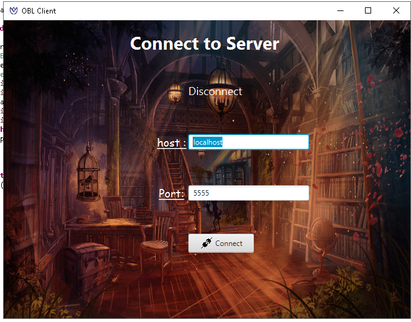
* #### the firsts page of the client for reader login (no registers in the system can search for books) :
 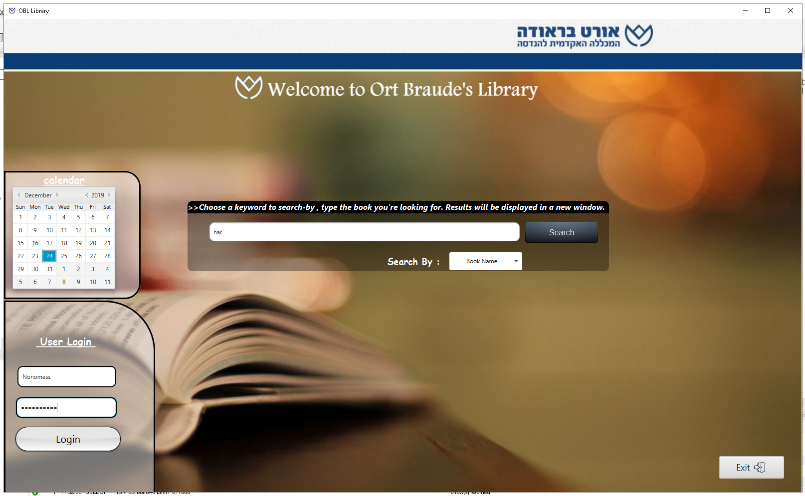
 * #### anyone can search for books in the system :
 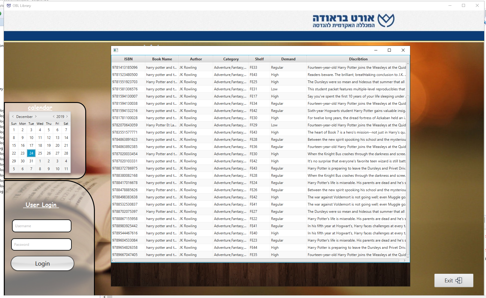
 * ### after the user (reder not worker or manger) login he will get  : 
  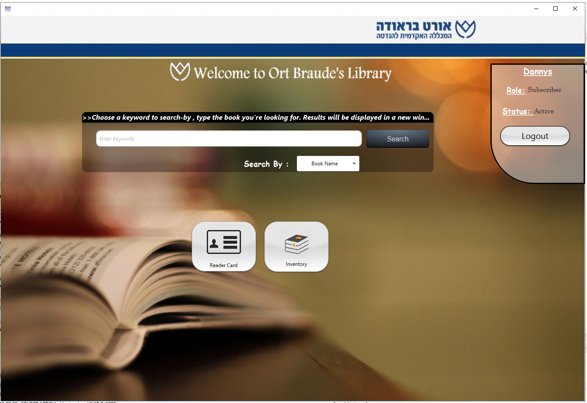 
 * ### and he can see his active and more : 
 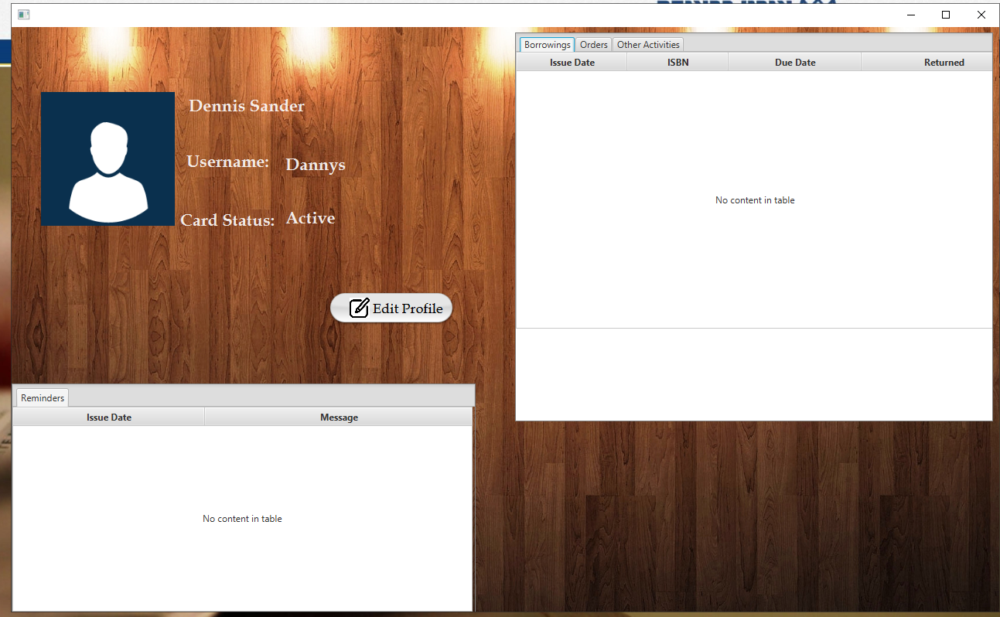
 * ### if the user is an manger ( have another permissions than reder) :
 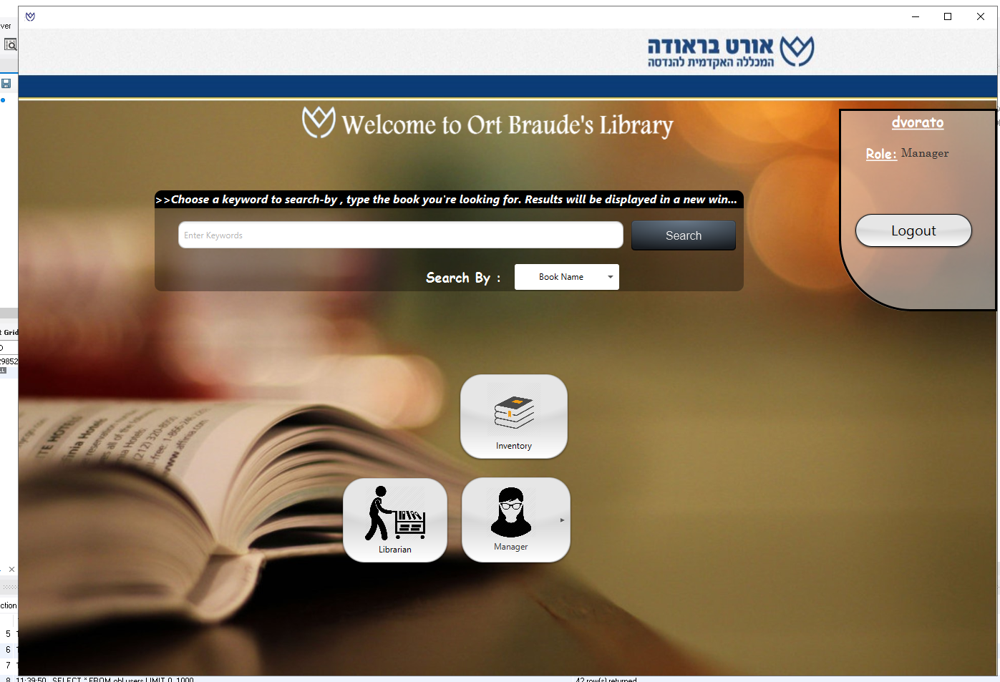
 * ### like add/remove worker ,book and reader type (acctive,blocked...) and reports:
 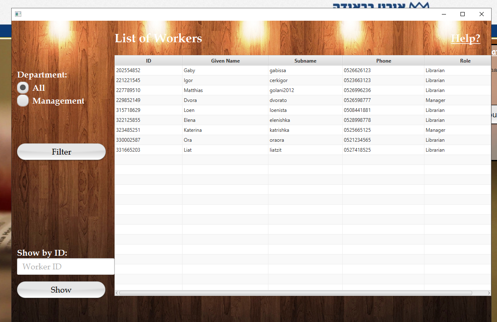
 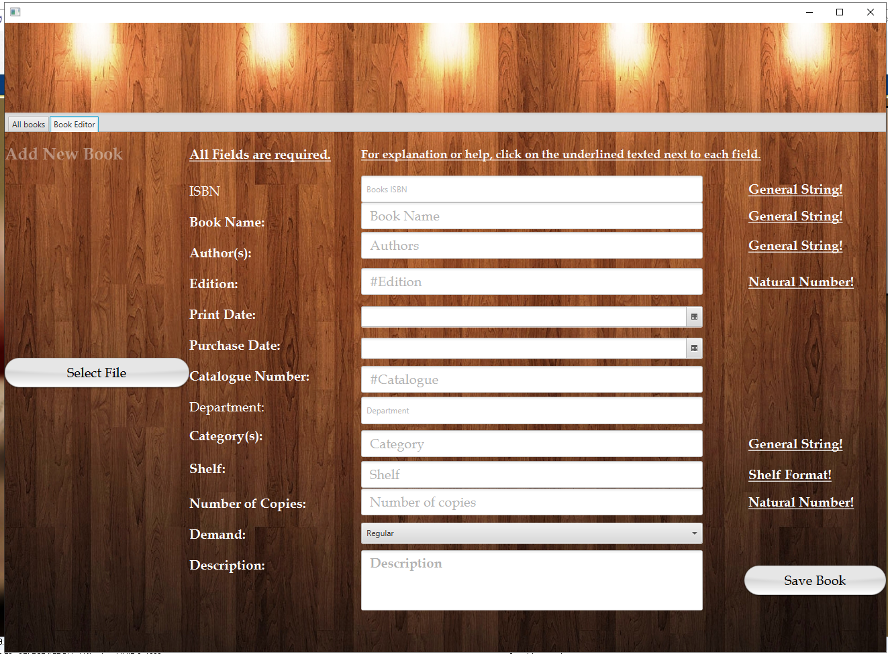
 
   
 * ## the server side (connect to database) :
 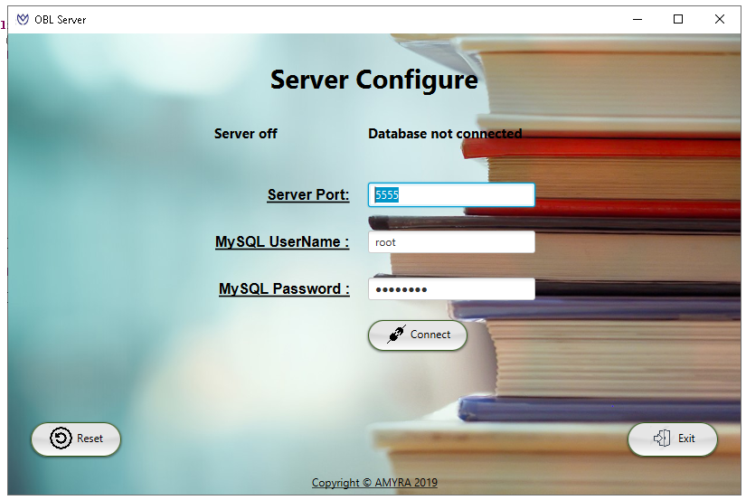
 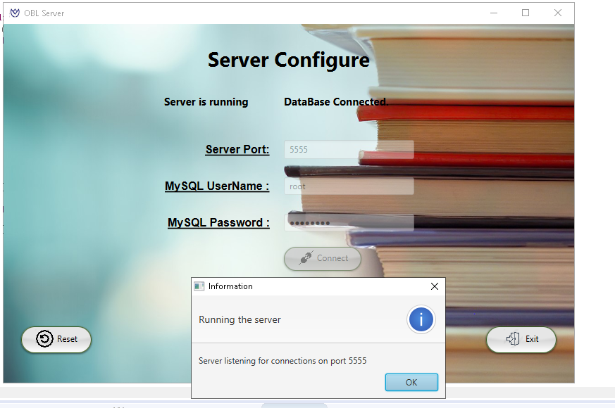
* ## the database in MYSQL (some of the tables in our schema) :
* #### users:
 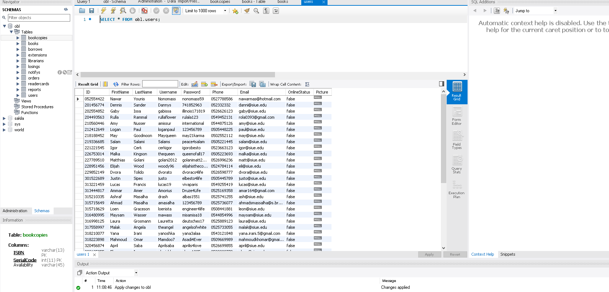
* ### books:
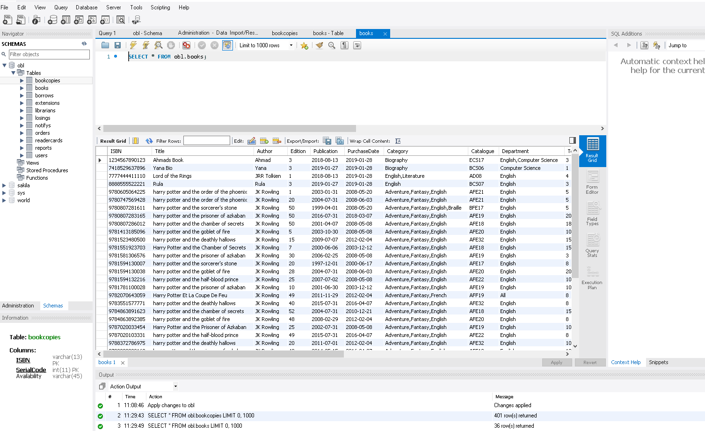
* ### borrow:
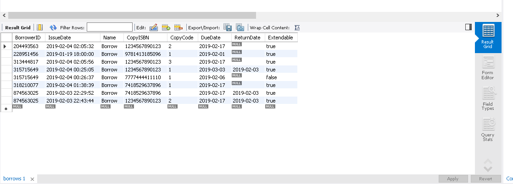
